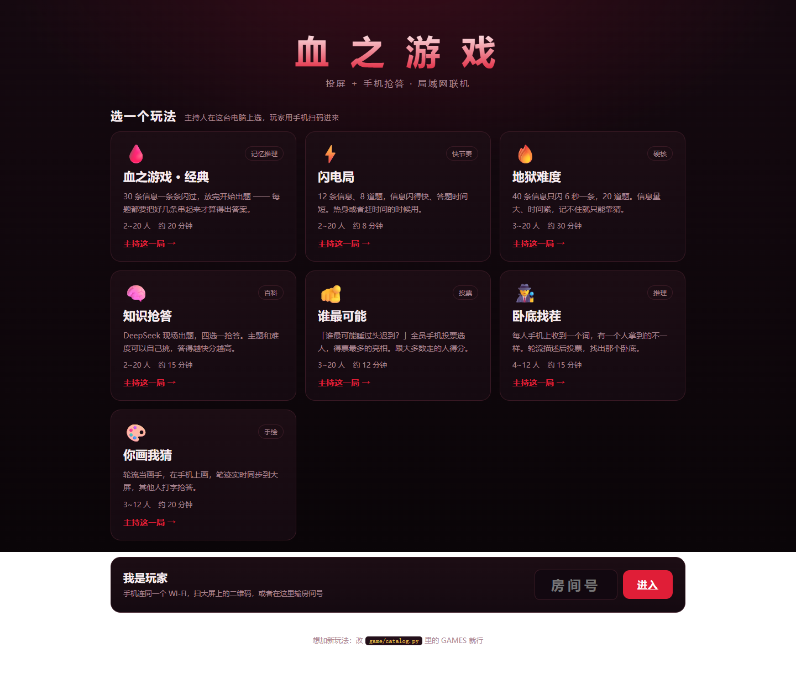
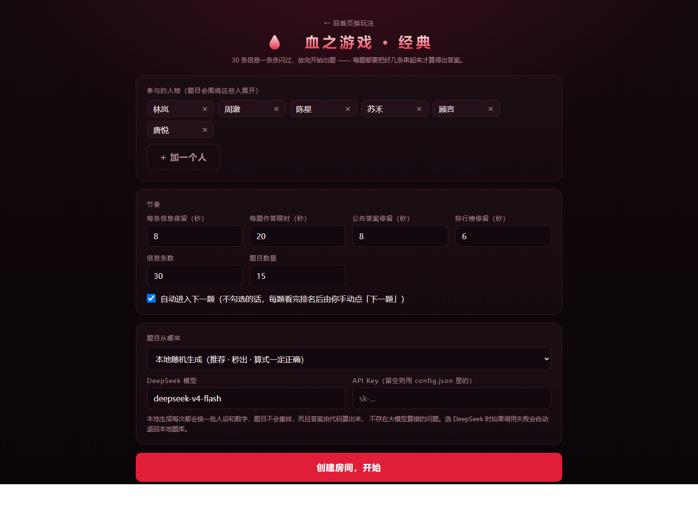
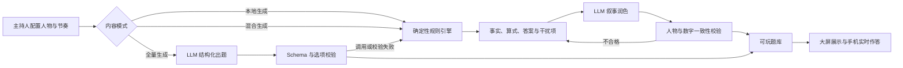

# BloodGame AI｜血之游戏

[](https://github.com/varianli/blood-game-ai/actions/workflows/tests.yml)

一个面向线下聚会的生成式 AI 多人互动游戏平台：主持人把电脑投到大屏，玩家通过手机扫码进入同一房间，完成记忆推理、知识抢答、社交投票、卧底推理和实时绘画等游戏。

项目的核心不是把聊天模型嵌进页面，而是用“确定性规则引擎 + LLM 内容生成/润色 + 输出校验 + 自动降级”解决聚会游戏内容重复、人工备题成本高和模型答案不稳定的问题。



## 产品亮点

- **完整多人体验**：主持人端、大屏展示和手机玩家端协同，支持扫码入房、实时作答、计分排名、断线重连、跨玩法切换与整晚累计积分。
- **7 种可玩模式**：Memory 12 · 闪电、Memory 30 · 标准、Memory 40 · 极限、知识抢答、谁最可能、卧底找茬、你画我猜。
- **2–20 人局域网联机**：使用 Python 标准库 HTTP 服务与长轮询同步，不依赖外部 Web 框架。
- **可配置游戏节奏**：参与人物、信息数量、题目数量、每阶段时长以及自动/手动推进均可由主持人调整。
- **模块化玩法扩展**：新玩法通过目录注册；不同规则实现统一的 `build / start / advance / submit / snapshot` 生命周期。



## AI 产品设计

### 1. 混合式生成，而非完全依赖模型

经典推理玩法提供四种内容路径：

| 模式 | 内容生产方式 | 适用场景 |
|---|---|---|
| 本地综艺风格生成 | 代码混排人物线索、颜色图形、短码、牌面、路线、日期与清单，并生成可验证答案 | 默认模式，无需 API 且秒级生成 |
| 本地 + DeepSeek 润色 | 本地引擎负责事实与答案，模型只增强叙事 | 兼顾准确性与趣味性 |
| DeepSeek 全量生成 | 模型生成整套信息和推理题 | 内容自由度更高，适合人工预览后使用 |
| 内置示例题库 | 固定匿名样例 | 无网络演示和快速体验 |

知识抢答、谁最可能、卧底找茬和你画我猜也可以调用 DeepSeek 动态生成主题内容。API Key 与模型按房间设置，输入一次即可跨玩法共用。知识抢答的简单、中等、困难不是文字标签：提示词规定可执行的难度标准，服务端还会按 `difficulty` 分数过滤不达标题目；调用或校验失败时会明确显示“难度降级”，再用基础题库继续游戏。

Memory 的节目题型拆解、内容配额与 Prompt 硬约束统一维护在 [`docs/memory30_style_guide.md`](docs/memory30_style_guide.md)。DeepSeek 全量生成会在运行时读取这份文档，而不是只把它当作说明材料。

### 2. 模型输出 Guardrails

- 要求模型返回结构化 JSON，并校验信息、题目和选项结构。
- 检查四个选项非空且互不重复、正确答案下标合法、引用信息编号有效。
- 润色模式逐句比对人物和数字；模型改动关键事实时，只回退该句而不是废弃整套内容。
- 服务端重新打乱正确答案位置，降低模型偏爱 A 选项造成的可预测性。
- 保留题目解析与引用信息编号，方便主持人检查全量生成内容。

### 3. 延迟与可用性设计

- 第一套题生成后，后台预生成下一套并缓存，“再来一局”无需重新等待。
- 网络异常、余额不足、Key 无效或模型输出不合格时，自动降级到本地生成器。
- 本地生成器同时承担可靠兜底：答案由程序计算，避免 LLM 算术错误中断现场体验。



## 快速开始

### 环境要求

- Python 3.11+
- 所有设备连接同一个 Wi-Fi
- 可选：DeepSeek API Key（本地生成无需 Key）

### Windows 一键启动

双击 `启动.bat`。程序会先打开游戏厅：

- 游戏厅：`http://localhost:8000/`（启动后默认打开）
- 主持人控制台：从游戏厅选择玩法后进入
- 玩家：扫描大屏二维码，或打开大屏显示的局域网地址

首次双击 `启动.bat` 时，程序会在项目内创建独立的 `.venv` 环境并自动安装二维码组件；以后启动无需重复安装。若直接运行 `server.py`，请先执行：

```powershell
python -m pip install -r requirements.txt
```

如果二维码组件仍不可用，房间页会明确提示玩家直接输入旁边的局域网网址，不再显示空白方框。

### 配置 DeepSeek

推荐使用环境变量，避免将密钥写入项目文件：

```powershell
$env:DEEPSEEK_API_KEY = "你的 API Key"
$env:DEEPSEEK_MODEL = "deepseek-v4-flash"
py server.py
```

也可以复制 `config.example.json` 为 `config.json` 后填写本地配置。`config.json` 已被 `.gitignore` 排除，不会进入 Git 历史。

还可以在创建房间时，直接在“房间 AI 设置”中输入模型和 API Key；创建后也能在等待大厅里更新并重新出题。这份密钥只保存在当前房间的服务端内存中，不会下发给玩家，也不会写入浏览器存储，房间清除或服务重启后即消失。

可用环境变量：

| 变量 | 作用 |
|---|---|
| `DEEPSEEK_API_KEY` | DeepSeek API Key |
| `DEEPSEEK_MODEL` | 模型名称 |
| `BLOOD_GAME_PORT` | 服务端口，默认 8000 |
| `BLOOD_GAME_OPEN_BROWSER` | 是否启动时自动打开浏览器 |

## 游戏流程

```text
主持人选玩法并创建房间
  → 玩家扫码加入
  → 大屏逐条展示信息
  → 玩家手机限时作答
  → 公布答案与个人得分
  → 实时排行榜
  → 后台准备下一套内容
```

经典推理玩法采用“基础分 + 速度分 + 连对奖励”；其他玩法分别实现投票、卧底胜负和画手/猜题者协作计分。

## 验证

离线生成与 Guardrail 测试：

```powershell
py -m unittest discover -s tests -p "test_*.py" -v
```

完整多人流程模拟（先启动服务，再指定对应端口）：

```powershell
py server.py 8137
py tests/sim.py 8137
```

端到端模拟覆盖建房、玩家加入、题库生成、长轮询、完整答题流程、计分排名、主持人权限、静态资源和二维码。

## 项目结构

```text
server.py                 HTTP 服务、路由与长轮询
game/
  engine.py               房间状态机、计分、预生成与降级
  gen_local.py            确定性本地题库生成器
  gen_ai.py               DeepSeek 生成、润色与输出校验
  catalog.py              玩法目录与默认参数
  modes/                  知识、投票、卧底、绘画等玩法模块
data/default_set.json     匿名示例题库
web/                      游戏厅、主持人端、玩家端与样式
tests/                    生成护栏测试与多人端到端模拟
```

## 使用边界

- 当前版本面向同一可信局域网内的线下聚会，不应直接暴露到公网。
- 房间与分数保存在内存中，服务重启后会清空。
- DeepSeek 全量出题只能保证结构通过校验，不能保证所有复杂算术都正确；正式活动建议预览解析，或使用推荐的混合生成模式。
- 不要提交真实 `config.json`、`.env` 或任何 API Key。如果密钥曾经进入公开 Git 历史，请立即轮换。
